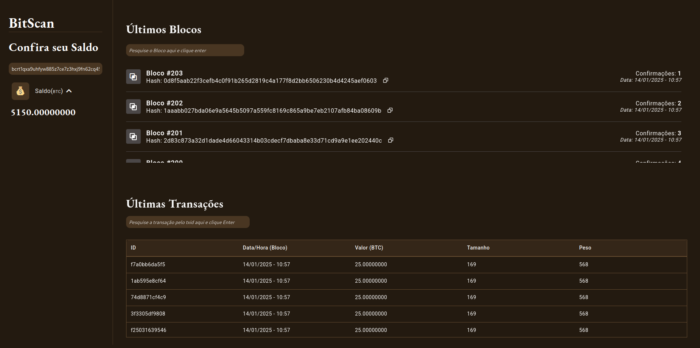

# Explorer BTC
### Grupo - Cruzados do Código ⚔️🎲👩‍💻


**Primeiro projeto** do estudo de 5 semanas da [NearX](https://nearx.com.br/pt/home) sobre desenvolvimento na rede Bitcoin e Lightning Network ! 😲 🚀

# 🤺 Sobre o projeto

Esse projeto é um **Explorador de Blocos** que conecta-se ao nó Bitcoin é tem as seguintes funcionalidades: 

  -  Busca um bloco pelo número.
  -  Buscar uma transação pelo hash.
  -  Exibir o saldo de uma carteira com base no endereço.




## Pré-requisito
- [Docker](https://docs.docker.com/engine/install/)


## Instruções para executar via Docker

```
git clone https://github.com/dev-araujo/explorer-btc.git
```
```
cd explorer-btc
```
- Na pasta server duplica o arquivo **.env.template** e renomeia para **.env**
```
docker compose up
```

A aplicação estará disponível em http://localhost:5173


## 🤝 Colaboradores

Às seguintes pessoas que contribuíram para este projeto:

<table>
  <tr>
    <td align="center">
      <a href="https://github.com/Luan-Web3" title="Luan Henrique">
        <br>
        <sub>
          <b>Luan Henrique</b>
        </sub>
      </a>
    </td>
    <td align="center">
      <a href="https://github.com/profmarciojmorais" title="Marcio Morais">
        <br>
        <sub>
          <b>Marcio Morais</b>
        </sub>
      </a>
    </td>
    <td align="center">
      <a href="https://github.com/dev-araujo" title="Adriano P. Araujo">
        <br>
        <sub>
          <b>Adriano P. Araujo</b>
        </sub>
      </a>
    </td>
      <td align="center">
      <a href="https://github.com/costaadiego1989" title="Diego Costa">
        <br>
        <sub>
          <b>Diego Costa</b>
        </sub>
      </a>
    </td>
  </tr>
</table>
